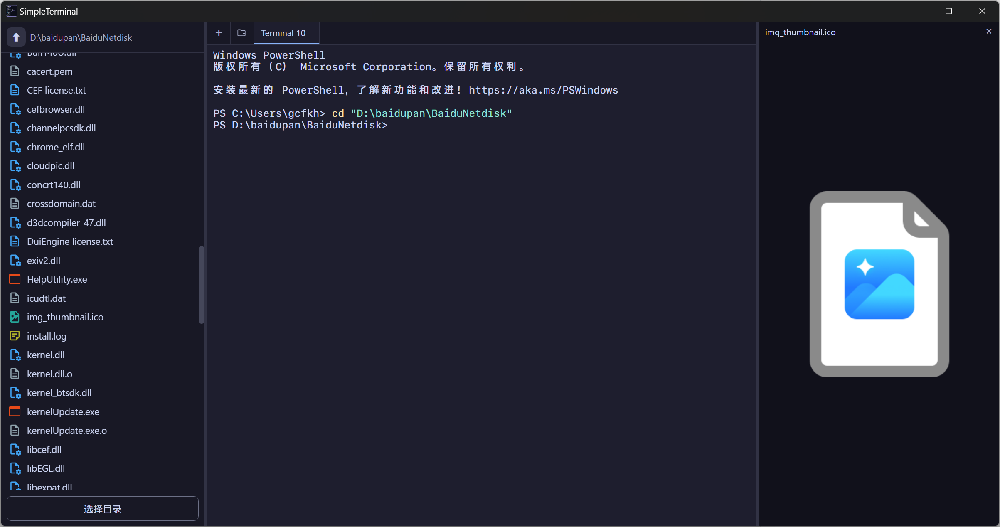

# simpleTerminal

> A clean Windows terminal with a built-in file tree — drag files, preview them, and run multiple shell sessions side by side.

**[中文](#简介) | [English](#introduction)**

---

## 简介

**simpleTerminal** 是一个专为 Windows 设计的桌面终端工具。左侧是可导航的文件目录树，右侧是真实的 PowerShell 终端，两者通过拖拽直接联动。

### 为什么做这个？

用过一圈现有工具，都有各自的短板：

| 工具 | 问题 |
|------|------|
| **Windows Terminal** | 没有文件目录面板，切换目录只能手打路径 |
| **VSCode / Trae / CodeBuddy 内置终端** | 与 AI CLI（如 Claude Code、Aider）长时间交互后文字花屏、渲染卡顿 |
| **Warp** | 功能过于复杂 |
| **WindTerm** | 不支持从文件树拖拽文件并自动粘贴路径到命令行 |

simpleTerminal 只做一件事：**让文件树和终端无缝配合**，其余保持克制。

### 功能

- **文件目录树** — 点击文件夹导航，记住上次打开的目录，支持选择任意根目录
- **真实 PowerShell 终端** — 基于 Windows ConPTY，行为与原生终端一致
- **拖拽路径注入** — 从文件树把文件/文件夹拖到终端，路径自动出现在光标处（含空格自动加引号）
- **多标签页** — 同时运行多个独立 Shell 会话，滚轮切换标签，切换不丢失历史输出
- **文件预览侧栏** — 点击文件即可预览，右侧侧栏显示：
  - 图片（PNG / JPG / GIF / WebP / SVG / BMP / ICO）— 支持滚轮缩放
  - 代码（TypeScript / Go / Python / Rust / JSON / YAML 等 40+ 种语言语法高亮）
  - Markdown — 渲染为格式化页面
  - 视频（MP4 / WebM / MKV / AVI / MOV）— 支持 Range 请求流式播放
- **面板宽度可拖拽** — 文件树和预览侧栏均可通过拖动分隔线调整宽度，持久化保存
- **Catppuccin Mocha 主题** — 深色配色，长时间使用不疲眼
- **字体** — SF Mono / Consolas / MiSans Medium，终端与预览保持一致

### 技术栈

| 层 | 技术 |
|----|------|
| 桌面框架 | [Wails v2](https://wails.io)（Go 后端 + WebView2） |
| 前端 | Vue 3 + TypeScript + Vite |
| 终端渲染 | [xterm.js](https://xtermjs.org)（WebGL → Canvas → DOM 降级） |
| PTY 进程 | Windows ConPTY（[conpty](https://github.com/UserExistsError/conpty)） |
| 语法高亮 | [highlight.js](https://highlightjs.org) |
| Markdown | [marked](https://marked.js.org) |
| 图标 | [vscode-material-icon-theme](https://github.com/material-extensions/vscode-material-icon-theme) |

> **仅支持 Windows**（ConPTY 和 PowerShell 均为 Windows 专属）

### 截图



### 构建与运行

**前置依赖**

- Go 1.21+
- Node.js 18+
- [Wails CLI](https://wails.io/docs/gettingstarted/installation)：`go install github.com/wailsapp/wails/v2/cmd/wails@latest`
- WebView2（Windows 10/11 通常已内置，可运行 `wails doctor` 检查）

**开发模式（热重载）**

```bash
cd SimpleTerminal
wails dev
```

**生产构建**

```bash
cd SimpleTerminal
wails build
# 输出：build/bin/SimpleTerminal.exe
```

### License

MIT

---

## Introduction

**simpleTerminal** is a Windows desktop terminal with a built-in file tree. The left panel shows a navigable directory tree; the right panel hosts a real PowerShell session. Drag a file from the tree directly into the terminal — its path lands at your cursor, quoted automatically if it contains spaces.

### Why build this?

Every existing tool has a gap:

| Tool | Problem |
|------|---------|
| **Windows Terminal** | No file panel — switching directories means typing paths by hand |
| **VSCode / Trae / CodeBuddy terminal** | Screen corruption and rendering lag after extended AI CLI sessions (Claude Code, Aider, etc.) |
| **Warp** | Too feature-heavy |
| **WindTerm** | No drag-and-drop path injection from a file tree |

simpleTerminal does one thing well: **seamless file tree + terminal integration**, without the bloat.

### Features

- **File directory tree** — click to navigate, remembers last directory, pick any root folder
- **Real PowerShell terminal** — backed by Windows ConPTY, behaves identically to a native shell
- **Drag-to-terminal path injection** — drag any file or folder onto the terminal; its path is pasted at the cursor (spaces quoted automatically)
- **Multi-tab sessions** — run multiple independent shell sessions simultaneously; scroll wheel switches tabs; switching preserves full scroll history
- **File preview sidebar** — click any file to preview it in a resizable right-side panel:
  - **Images** (PNG / JPG / GIF / WebP / SVG / BMP / ICO) — scroll wheel zoom
  - **Code** (TypeScript, Go, Python, Rust, JSON, YAML, and 40+ more) — syntax highlighted
  - **Markdown** — rendered as a formatted document
  - **Video** (MP4 / WebM / MKV / AVI / MOV) — streamed with HTTP range requests
- **Resizable panels** — drag the dividers to adjust the tree and preview widths; widths are persisted across sessions
- **Catppuccin Mocha theme** — dark palette, easy on the eyes during long sessions
- **Font** — SF Mono / Consolas / MiSans Medium, consistent across terminal and preview

### Tech stack

| Layer | Technology |
|-------|-----------|
| Desktop framework | [Wails v2](https://wails.io) (Go backend + WebView2) |
| Frontend | Vue 3 + TypeScript + Vite |
| Terminal rendering | [xterm.js](https://xtermjs.org) (WebGL → Canvas → DOM fallback) |
| PTY process | Windows ConPTY via [conpty](https://github.com/UserExistsError/conpty) |
| Syntax highlighting | [highlight.js](https://highlightjs.org) |
| Markdown rendering | [marked](https://marked.js.org) |
| File icons | [vscode-material-icon-theme](https://github.com/material-extensions/vscode-material-icon-theme) |

> **Windows only** — ConPTY and PowerShell are Windows-specific.

### Screenshots


### Build & Run

**Prerequisites**

- Go 1.21+
- Node.js 18+
- [Wails CLI](https://wails.io/docs/gettingstarted/installation): `go install github.com/wailsapp/wails/v2/cmd/wails@latest`
- WebView2 (bundled on Windows 10/11; run `wails doctor` to verify)

**Development (hot reload)**

```bash
cd SimpleTerminal
wails dev
```

**Production build**

```bash
cd SimpleTerminal
wails build
# Output: build/bin/SimpleTerminal.exe
```

### License

MIT
